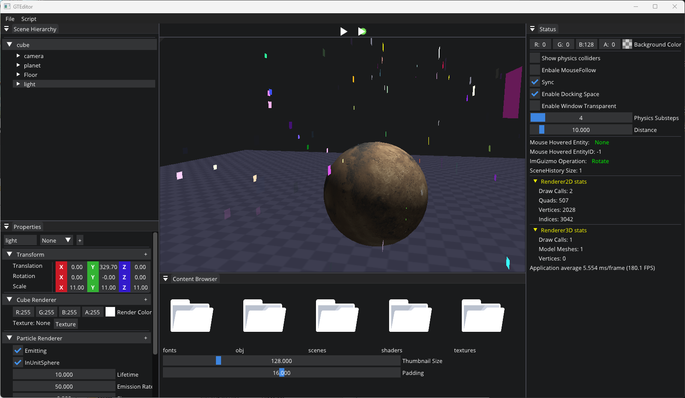

# 🎮 GT Engine

> **GT Engine** (Game Toolkit) 是一个基于 **[The Cherno 的 Hazel 引擎](https://github.com/TheCherno/Hazel)** 进行修改与重构的 **学习研究型项目**。

## 📖 项目介绍

该项目基于 **[The Cherno 的 Hazel 引擎](https://github.com/TheCherno/Hazel)** ，大致进度为刚准备添加脚本引擎。

目前新增 3D模型渲染，粒子系统，以及 资源热重载（用于实时更新 纹理，着色器） 功能 （十分简陋的实现）。

## 项目规划

1. 完善粒子系统。 （扩充基础功能）
2. 完善 3D 渲染。 （增加多光源，背面剔除， 视锥裁剪 ...）
3. 加入多线程， 实现 Job System

## 项目架构

GT/src        GT引擎位置

GT/vendor     GT引擎第三方依赖库

GTEditor      GT编辑器位置

scripts       存放方案生成脚本

### 构建与运行

如果是使用 Windows vs2022 打开 GT.sln，自行构建即可。

如果使用其他 IDE 需要修改 scripts/Win-GenerateProject.bat 用 premake5 重新生成。

至于 Linux，Mac 就需要修改项目 premake5.lua 文件进行适配。